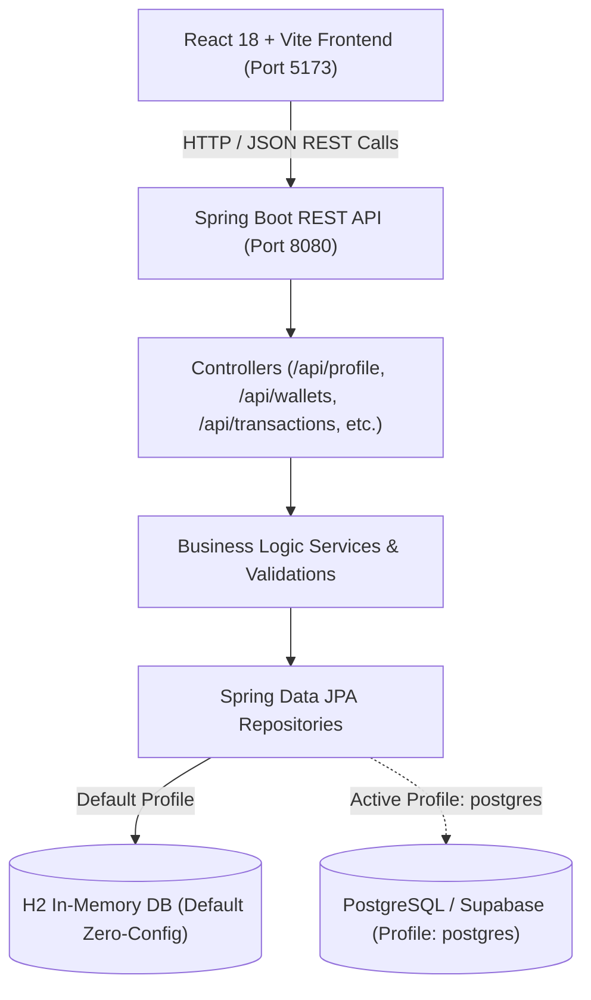

# Xpense – Java Full Stack Personal Finance & Expense Management System

[](https://www.oracle.com/java/)
[](https://spring.io/projects/spring-boot)
[](https://spring.io/projects/spring-data-jpa)
[](https://react.dev/)
[](https://vitejs.dev/)
[-0078D7)](http://www.h2database.com/)
[](https://www.postgresql.org/)

An enterprise-grade, high-performance **Java Full Stack** personal finance and expense-management platform built with a **Java Spring Boot 3** REST API backend and a **React 18 (Vite)** frontend.

---

## 🏛️ System Architecture



---

## 🌟 Key Features

1. **Java Spring Boot Backend Architecture**:
   - **RESTful Endpoints**: Full CRUD for profiles, wallets, transactions, budgets, and savings goals.
   - **Data Validation**: Jakarta Bean Validation (`@Valid`, `@NotNull`, `@DecimalMin`).
   - **Global Exception Handling**: Central `@RestControllerAdvice` returning clean JSON envelopes.
   - **Dual Database Support**: Zero-configuration H2 database by default + production-ready PostgreSQL / Supabase profile.
   - **Data Initializer**: Automatically provisions demo student records (*Aditya Venkata Sai Burle*, ID `128003008@sastra.ac.in`), category wallets, and sample transactions upon launch.
   - **H2 Web Console**: Built-in visual database browser at `http://localhost:8080/h2-console`.

2. **Intelligent Financial Dashboard (Home Screen)**:
   - Live Total Balance with toggleable privacy mask (`••••••••`).
   - Quick action triggers: **Scan & Pay**, **Send Money**, and **Receive Money**.
   - 2x2 Metric Grid: Monthly Spend, Today's Spending, Active Goals counter, and 7-day Avg Daily Spend.
   - **AI Insights & Spending Buddy**: Real-time spending recommendations and envelope health alerts.
   - Live Recent Transactions feed with instant balance updates.

3. **Smart Wallets (Envelopes)**:
   - Dedicated spending categories (*Food & Dining, Transportation, Entertainment, Shopping & Utilities*).
   - Dynamic cycle days counter and visual progress bars tracking spent balance against monthly limits.
   - Categorized health badges (`Good`, `Low`, `Warning`).
   - **Interactive Top Up**: Instantly inject funds into any wallet envelope with quick-select pills (+₹100, +₹500, +₹1,000).

4. **Savings Goals Tracker**:
   - Define custom financial milestones with target amounts and completion dates.
   - Real-time progress bars with percentage tracking.
   - Confetti-celebrated deposit modal for contributing funds.
   - **💡 Goal Ideas**: Pre-configured templates (*Emergency Fund, Semester Break Trip, New Laptop, Course Materials*).

5. **Scan & Pay (Instant Merchant Payments)**:
   - Verified merchant details with live status badges (*The Coffee House, Campus Cafeteria, etc.*).
   - Dynamic debit source selection across active wallet envelopes.
   - Bottom-sheet confirmation drawer showing *Current Balance → Balance After Transfer*.

6. **Receive Money via Dynamic UPI QR**:
   - Generates real-time, standards-compliant UPI QR codes (`upi://pay?pa=...&pn=...&am=...`) using canvas rendering.
   - Dynamic amount update reflecting directly inside the QR payload.
   - One-click UPI link clipboard copy & integrated payment simulator.

7. **Send Money (Peer Transfers)**:
   - Dedicated endpoint `POST /api/transactions/transfer`.
   - Contact avatars, custom amounts, wallet selection, and instant ledger deduction.

8. **Financial Analytics & AI Insights**:
   - Spending breakdown by category with automatic percentage calculation.
   - Month-over-month trend comparison (*This Month vs. Last Month with +/- percentage change*).
   - Server-side analytics aggregation via `GET /api/analytics`.

---

## 🛠️ Technology Stack

| Tier | Technology | Description |
|---|---|---|
| **Backend Framework** | Java 17/21/25, Spring Boot 3.3.5 | Modern enterprise Java REST API |
| **ORM / Persistence** | Spring Data JPA / Hibernate 6 | Declarative database management |
| **Default Database** | H2 In-Memory Database | Instant zero-setup local persistence |
| **Production Database** | PostgreSQL / Supabase | Enterprise relational database |
| **Frontend Framework** | React 18.3, Vite 5.4 | Ultra-responsive client UI |
| **Icons & UI Delight** | Lucide React, canvas-confetti | Fluid interactions and modern icons |
| **QR Code Engine** | qrcode | Canvas-based dynamic UPI QR code generator |

---

## 📂 Project Directory Structure

```
Xpense/
├── run-all.bat                    # One-click Windows runner (Starts backend & frontend)
├── run-backend.bat                # Starts Spring Boot backend (Port 8080)
├── run-frontend.bat               # Starts React Vite frontend (Port 5173)
├── README.md                      # Complete project documentation
├── Xpense_Project_Documentation.docx
│
├── backend/                       # Java Spring Boot 3 Backend
│   ├── pom.xml                    # Maven build file with Spring Boot dependencies
│   └── src/
│       ├── main/
│       │   ├── java/com/xpense/
│       │   │   ├── XpenseApplication.java
│       │   │   ├── config/        # CORS & DataInitializer
│       │   │   ├── controller/    # REST Controllers
│       │   │   ├── dto/           # Request/Response DTOs & ApiResponse wrapper
│       │   │   ├── exception/     # GlobalExceptionHandler & Custom Exceptions
│       │   │   ├── model/         # JPA Entities (UserProfile, Wallet, Transaction, etc.)
│       │   │   ├── repository/    # Spring Data JPA Repositories
│       │   │   └── service/       # Business Logic Services
│       │   └── resources/
│       │       ├── application.properties          # Default H2 profile
│       │       └── application-postgres.properties # PostgreSQL / Supabase profile
│       └── test/
│           └── java/com/xpense/   # Spring Boot integration tests
│
└── frontend/                      # React 18 + Vite Frontend
    ├── .env                       # Frontend environment variables (VITE_API_BASE_URL)
    ├── .env.example
    ├── package.json
    ├── vite.config.js
    └── src/
        ├── App.jsx
        ├── styles.css
        ├── components/            # UI Views (Home, Wallets, Goals, Analytics, ScanPay, etc.)
        ├── context/               # Auth & Session state
        ├── data/                  # Demo / Seed data
        └── services/              # API Client & Backend REST Integration
```

---

## 🚀 Getting Started

### Prerequisites
- **Java JDK**: 17, 21, or 25 installed (`java -version`)
- **Maven**: 3.8+ installed (`mvn -v`)
- **Node.js**: 18+ installed (`node -v`)

---

### Option A: One-Click Startup (Windows)
Double-click [`run-all.bat`](./run-all.bat) or run from your terminal:
```bash
.\run-all.bat
```
This automatically launches both the Spring Boot REST API and the React Vite client in separate terminal windows.

---

### Option B: Manual Startup

#### 1. Start the Java Spring Boot Backend
```bash
cd backend
mvn spring-boot:run
```
- **Backend API**: `http://localhost:8080/api`
- **H2 Database Console**: `http://localhost:8080/h2-console`
  - JDBC URL: `jdbc:h2:mem:xpensedb`
  - Username: `sa`
  - Password: *(leave blank)*

#### 2. Start the React Frontend
In a new terminal window:
```bash
cd frontend
npm install    # (if running for the first time)
npm run dev
```
- **Frontend App**: `http://localhost:5173`

---

## 🔌 Spring Boot REST API Reference

All responses follow the unified envelope:
```json
{
  "success": true,
  "message": "Operation successful",
  "data": { ... }
}
```

### 1. User Profile (`/api/profile`)
| Method | Endpoint | Description |
|---|---|---|
| `GET` | `/api/profile` | Retrieve the active user profile & total balance |
| `PUT` | `/api/profile` | Update profile preferences and total balance |

### 2. Wallets (`/api/wallets`)
| Method | Endpoint | Description |
|---|---|---|
| `GET` | `/api/wallets` | List all wallets/envelopes |
| `GET` | `/api/wallets/{id}` | Get single wallet details |
| `POST` | `/api/wallets` | Create a new spending envelope |
| `PUT` | `/api/wallets/{id}` | Update wallet details |
| `DELETE` | `/api/wallets/{id}` | Delete a wallet envelope |
| `POST` | `/api/wallets/{id}/topup` | Top up funds into a wallet |

### 3. Transactions (`/api/transactions`)
| Method | Endpoint | Description |
|---|---|---|
| `GET` | `/api/transactions` | Query transactions (supports `?category=`, `?type=`, `?walletId=`) |
| `GET` | `/api/transactions/{id}` | Get transaction by ID |
| `POST` | `/api/transactions` | Record a new expense or income |
| `POST` | `/api/transactions/transfer`| Process peer-to-peer / send money transfer |
| `DELETE` | `/api/transactions/{id}` | Delete a transaction record |

### 4. Budgets (`/api/budgets`)
| Method | Endpoint | Description |
|---|---|---|
| `GET` | `/api/budgets` | List all category budgets |
| `POST` | `/api/budgets` | Create or update budget limit |
| `DELETE` | `/api/budgets/{id}` | Remove a budget |

### 5. Savings Goals (`/api/savings-goals`)
| Method | Endpoint | Description |
|---|---|---|
| `GET` | `/api/savings-goals` | List all savings milestones |
| `POST` | `/api/savings-goals` | Create a savings goal |
| `PUT` | `/api/savings-goals/{id}` | Update goal details |
| `POST` | `/api/savings-goals/{id}/deposit` | Contribute funds to a goal |
| `DELETE` | `/api/savings-goals/{id}` | Remove a savings goal |

### 6. Analytics (`/api/analytics`)
| Method | Endpoint | Description |
|---|---|---|
| `GET` | `/api/analytics` | Returns monthly spend, today's spend, daily averages, and AI insights |

---

## 🗄️ Database Configuration & Switching

### 1. Default Mode (H2 In-Memory)
Requires **zero setup**. Runs out of the box when starting Spring Boot:
```bash
mvn spring-boot:run
```

### 2. PostgreSQL / Supabase Mode
To connect to an external PostgreSQL database or Supabase instance:
```bash
mvn spring-boot:run -Dspring-boot.run.profiles=postgres
```
Or set environment variables:
- `SPRING_DATASOURCE_URL`
- `SPRING_DATASOURCE_USERNAME`
- `SPRING_DATASOURCE_PASSWORD`

---

## 🧪 Testing & Validation

Run unit & integration tests on the Spring Boot backend:
```bash
cd backend
mvn test
```
Build frontend production bundle:
```bash
cd frontend
npm run build
```
